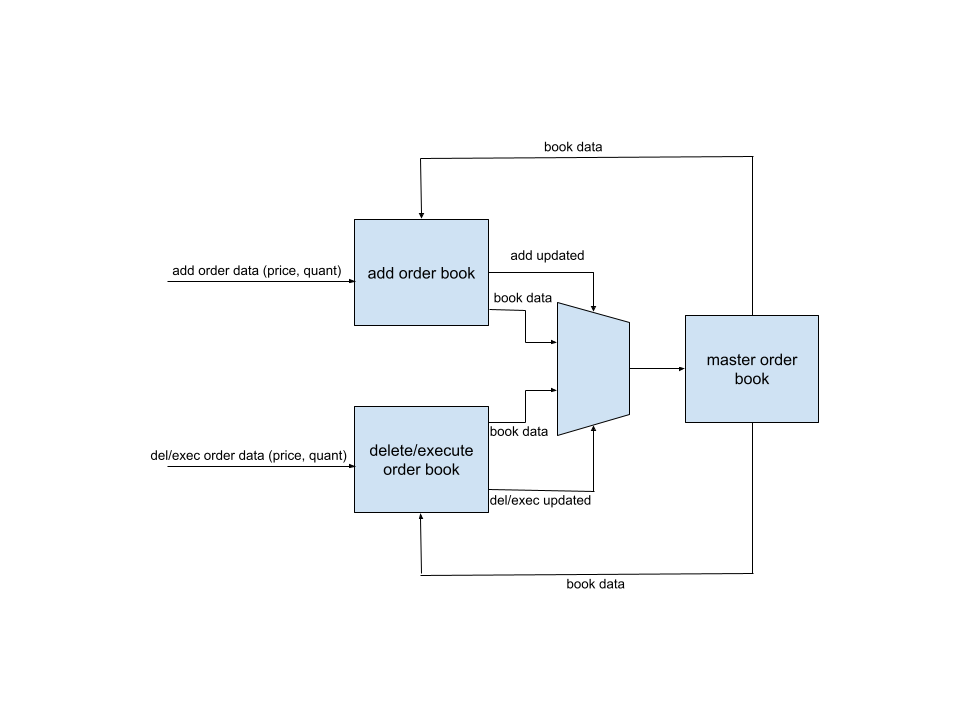
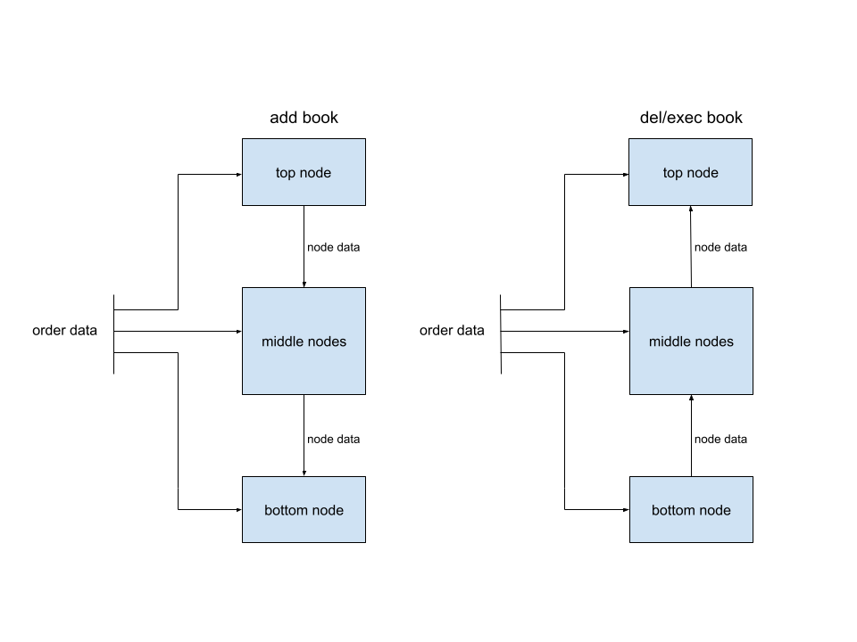

# FPGA 1G Ethernet to Book Engine for ITCH Market Data

## Overview
A low-latency FPGA implementation of 1G networking stack for processing UDP packets containing ITCH market data and maintaining an on fabric order book. Add, delete, and order executed messages are supported. The order map is fully functional and the buy side of the book is complete. Sell side, deeper verification, and hardware testing is in progress. Zero IP was used in this project (except for a Xilinx IP AFIFO which was used only to benchmark a custom CDC solution). **This project is in progress and is not a finished/polished work**

## Features
- **Custom MAC**
- **Low-Latency CDC**
- **Ethernet, IpV4, and UDP header parser**
- **ITCH Market Data Parser**
- **Configurable Depth Order Map**  (depth of 2k target for timing)
- **Configurable Depth Order Book** (depth of 5 targeted for timing)
- **Tick to Book Latency of 845ns for Add Order Messages**

## Architecture
### Data Path
1. **Custom MAC**
    - Performs essentially zero parsing of the incoming ethernet packet. It includes DDR decoding and then simply passes the received byte upstream.
    - Interfaces with 1G PHY via RMGII. Clock to data skew is acheived internally via MMCM generated clock.
2. **Low-Latency CDC**
    - Bytes are streamed from the 125MHz rx domain to the 250MHz processing domain.
    - While all processing could be done on the rx clk domain it is safer to process on a clock generated on device. The rx clk is provided off board making it susceptible to glitches. Also it is not guarenteed to be running at all times.
    - A circular AFIFO CDC method was implemented with a minimal synchronization pipeline.
    - Latency across the CDC is ~14ns compared to ~42ns of the Xilinx xpm_fifo_async IP which can be optionally generated in the design as a benchmark.
3. **Ethernet Header Parser**
    - Parses ethernet frame headers (eth, ip, udp, moldUdp64) as they stream in. If a valid frame has been received on the last byte, the proceeding ITCH data is passed through with zero cycles of latency added.
    - Checks MAC dest address, ip version, ip dest address, ip checksum, protocol, udp destination, and moldUdp64 sequence.
4. **ITCH Parser**
    - Extracts add, delete, and order executed message types. Also on-the-fly parsing where forwarded data is driven to the outputs when it is received.
    - Separate valid signals for each message type assert when all important fields have been received.
    - Data field outputs are shared (i.e reference number).
    - Zero additional cycles added to forwarded data.
4.  **Order Map**
    - The order map is of variable depth with 2K depth being targeted for timing closure.
    - A hash table is implemented where the received ITCH reference number is passed through a hash function to index into BRAM. The RAM is initialized to zeros which is how the insertion detects if an address has been written to. Upon order deletion, the location will be zeroed out freeing it for future use.
    - One 64bit X 2K BRAM is used for reference number storage while a second 65 bit X 2K BRAM is used for price, quantity, and side data of correlating reference number.
5. **Order Book** (buy side done, sell side in progress)
    - Add order message type implemented with tick to top of book update in 845ns.
    - Single instrument supported with variable depth.
    - All price levels are updated in 3 clock upon receiving a new order no matter the book depth. Add orders make it to the book level faster as delete/execute messages must be looked up in BRAM first, but both types only require 3 clocks once they are received.
    - Delete and Executed messages will have higher latency due to the need for a lookup in the map.
    - Node or "linked list" based design allows for scalable book depth. Levels of logic are O(1) as book depth increases. Even though level of logic are not a concern, routing congestion and fanout will ultimatelty limit book depth.

## Book Design
### Multi Book System
- A multi book system was implemented where two separate books per side are maintained. One book handles add order logic while the other book handles delete and execute order logic. When one book is updated it's contents are written to the master book. The master book then updates both add and delete books to keep them current.
- This approach was taken to reduce the high level of logic at each "node" (price level) to handle add orders (increment or insert and shift down) and del/exec orders (decrement or delete and shift up).
- The inlcuded figure below shows a simplified block diagram of this multi-book system.

### Individual Book Design
- The individual books follow a node based or a systolic array design. When a new order comes in each individual node processes the data separatly.
- Each node determines if the price matches it's current price. The nodes quantity can then increment or decrement (depending on book variant). If the price does not match each node checks if the price matched any node (results of price match comparison of all nodes ORed together) which initiates a shift.
- For the add order book variant only a shift down is implemented and the delete order book variant only has a shift up functionality. As can be seen in the block diagram below, the shifts are accomplished by every node having access to the data above or below it. This allows the entire book to shift in a single clock when either a new price level arrives or a price level is deleted by simply registering it's neighboring node.
- Separating the shift up and shift down functionality into two books (as well as increment and decrement) significantly reduces the logic depth of each node. This allows the increment/decrement and shift up/shift down logic to execute in a single clock.
- From new order receival the master book is updated in 3 clock cycles. One clock for each node to process the incoming price/quantity, one clock to increment/decrement or shift up/down, and one clock to update the master book.

## Map Design
### Basic Architecture
- The order map is implemented in BRAM and is of configurable depth. It is broken into two major BRAMs, one for the order refence numbers (64 bits) and one for price/quantity/side (65 bits).
- When a new add order arrives, it's refernce number is passed through a hash function to determine the BRAM address it will be stored at. The reference number and data are stored at the same address in both BRAMs.
- The hash function is a simple XORing of the reference number. Ex: refNum[11:0] xor [23:12] xor [35:24] etc...
- When an execute or delete order is received the same hashing function it used to look up the order. If the reference number matches the order data is returned to the book to decrement or delete a price level. If the reference number misses, the address is incremented until the correct reference number is found.

## Implementation Details
- Target Artix 7 FPGA. Diligent Nexy video board will be used for hardware verification (in progress).
- System Verilog for synthesizable code and test benches.

